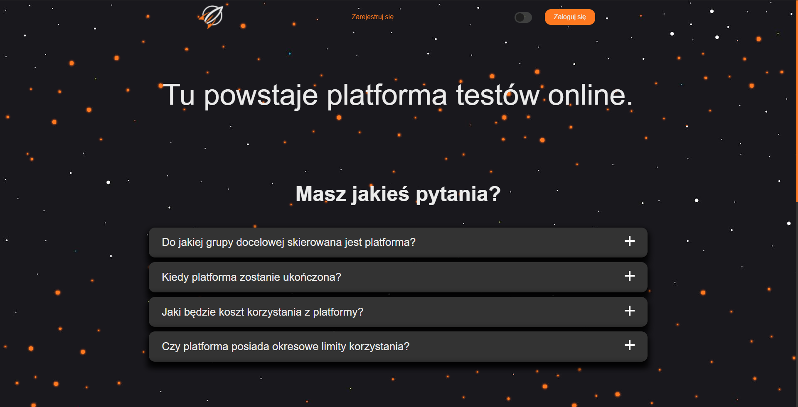
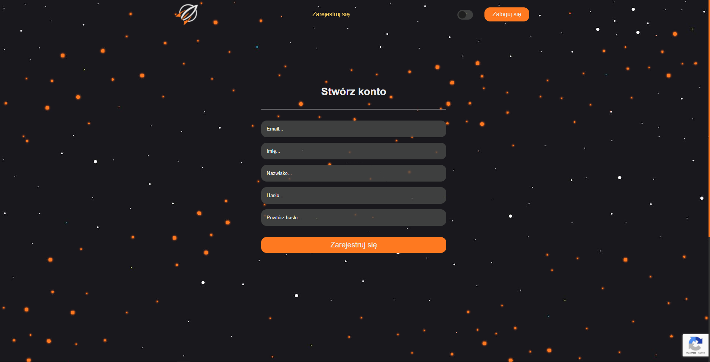
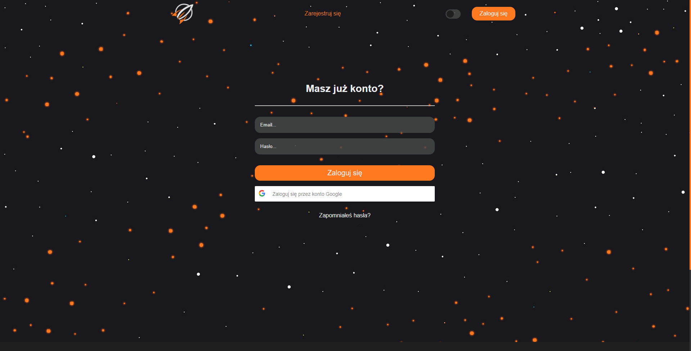
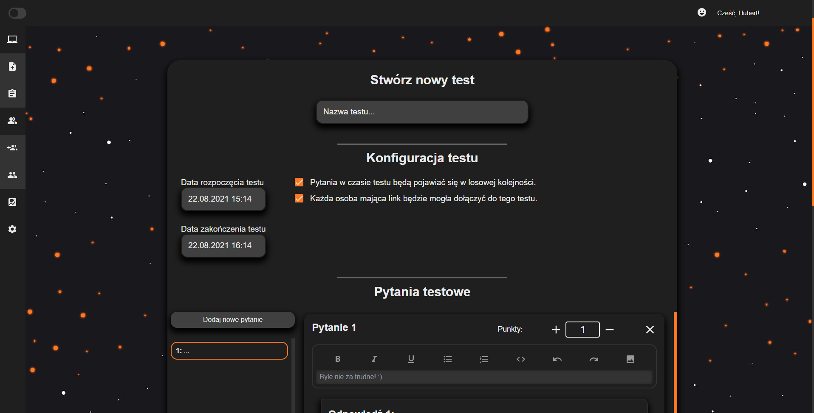
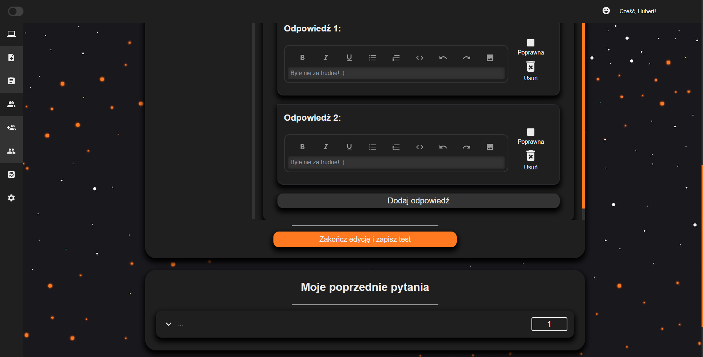
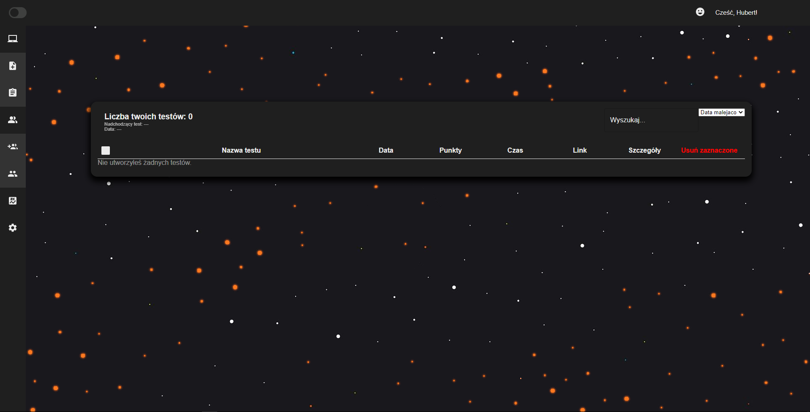

# CodeRevv

  

### Narzędzia do `webapp`
* VS Code + wtyczki
* `nodejs`
* `npm`
* Google Chrome + wtyczki `React Dev Tools` & `Redux Dev Tools`
* Cypress

### Narzędzia do `authservice`
* PyCharm
* `python`
* `mongodb`
* `virtualenv`
* Postman do API

### Narzędzia do `testservice`
* PyCharm
* `python`
* `mongodb`
* `FastAPI`
* `uvicorn`
* `virtualenv`
* Postman do API

### Wygląd aplikacji

#### Strona główna

  

#### Rejestracja

  

#### Logowanie

  

#### Tworzenie testu

  

  

#### Moje testy

  

